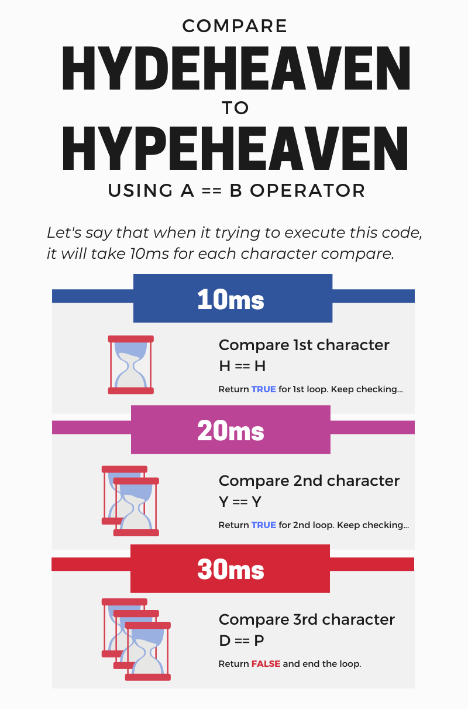
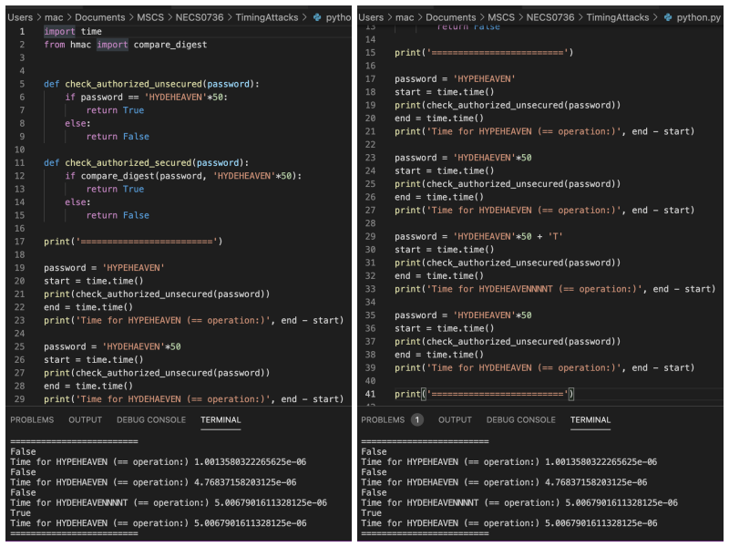

## Welcome to 1st episode of my series **Code for Security**.  
The most common string comparison in Python programming is **==**.  
  
However, when you coding as **a == b**, if a and b are of different lengths, or if an error occurs, a timing attack could theoretically reveal information about the types and lengths of a and b, but not their values.  
  
To reduce the vulnerability to these timing attacks, it is recommended to use the **compare_digest()** function instead **==** operator.  

### What is Timing Attacks?

Timing Attacks is a type of attack that uses the time taken to execute the algorithms to discover hints about secrets. Let's see this picture. 
   
<div align="center">  </div>
  
To execute comparing these 2 strings *HYDEHEAVEN* and *HYPEHEAVEN* with **a == b**, it will return value in 30ms.  
  
```markdown
def check_authorized(password):
    if password == 'HYDEHEAVEN':
        return True
    else:
        return False
```
  
If a programmer using this code to check the password to enter a vault and I can capture the responding time, I can use brute force attack to re-generate the 3rd character until the responding time change to 40ms. That's means I figure out the right 3rd character and then go next for 4th character and so on.
  
<div align="center">  <br>
<i><b>Picture 1:</b> Timing to execute '== operation'</i>
</div>
    
### Solution 
The Python standard library provides the function **compare_digest(a, b)** to be the solution to compare the two strings in a way that:  
- Compare all of the characters before returning true or false.  
- And also compare strings of equal length.  
  
This function only in Python 3.3+ with import - **from *hmac* import *compare_digest***.  
  
### Non-vulnerable code
From above code:  
```markdown
def check_authorized(password):
    if password == 'HYDEHEAVEN':
        return True
    else:
        return False
```  
  
We can change it to non-vulnerable code like this:  
```markdown
def check_authorized(password):
    if compare_digest(password, 'HYDEHEAVEN'):
        return True
    else:
        return False
```
  
**Easy?** Secured coding is just a flipped hand when you know the hint!

Let's hunt more vulnerable code to make **Code for Security** next episode. Stay tuned!  
  
**#TimingAttacks #Code4Sec**  
  
______________________________
<table border="0">
 <tr>
   <td> <h3><i>Although my profile picture is quiet, but the real me can make some noise.</i></h3>
      <hr>
      <b><font color="Blue"> Author: Vuttawat Uyanont </font></b>  <br>
      <font color="grey"><i>Sexiest former engineer & banker who interested in Tech, Sake, and Beer.</i></font>  <br>
      <b>Studying:</b> Master Computer Science in Cybersecurity Management at Mahanakorn University.  <br> </td>  
   <td></td>  
 </tr>
</table>
  
